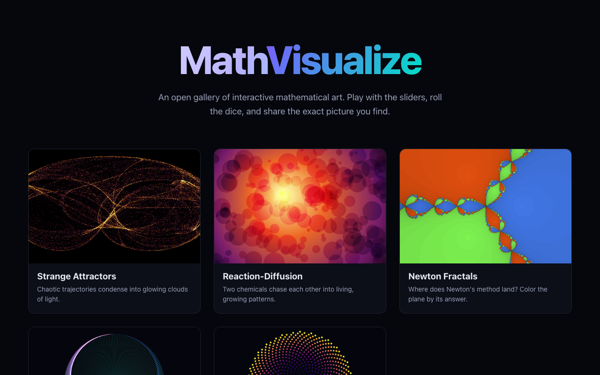

# MathVisualize

An open gallery of **interactive, shareable mathematical visualizations**. Play with
the sliders, roll the dice for a new random picture, export a PNG or a short WebM clip,
and copy a link that reproduces the exact image you found.

Pure front-end — no backend, no build server needed at runtime. It deploys as plain
static files to GitHub Pages, Vercel, Netlify, or anything that serves a folder.



## ✨ Visualizations

| | What it is |
|---|---|
| **Strange Attractors** | Clifford, De Jong, Lorenz and Thomas systems. Hundreds of thousands of points accumulate into a glowing, additively-blended cloud. Drag to rotate. |
| **Reaction-Diffusion** | The Gray-Scott model on the GPU (ping-pong float textures). Corals, zebra stripes, mazes and dividing cells. Paint seeds with the mouse. |
| **Newton Fractals** | Color the complex plane by which root Newton's method reaches. Type your own polynomial, scroll to zoom, drag to pan. Runs in a fragment shader. |
| **Modular Times Tables** | Connect point `i` to `(i·k mod N)` on a circle. Cardioids, nephroids and stars emerge; fractional `k` morphs them continuously. |
| **Phyllotaxis** | Sunflower seed packing by the golden angle. One slider takes you from chaotic rings to the perfect lattice at 137.5°. |

## 🎛 Shared features

- **Control panel** — auto-built from each visualization's parameter list. Collapsible (press `H`).
- **Random** (`R`) — a fresh, unique picture every time. "Surprise me" jumps to a random visualization already randomized.
- **Palettes** — Viridis, Inferno, Magma, Plasma, Turbo plus custom Aurora / Sunset / Ember / Ice / Mono gradients.
- **Export** — PNG (`S`) and short **WebM** screen recording via `MediaRecorder`.
- **Share** — encodes every parameter into the URL hash, so a link opens the exact same picture.
- **Responsive** — touch controls and a bottom-sheet panel on mobile.
- **Custom cursor** — a glowing comet trail (fine-pointer only; respects `prefers-reduced-motion`).
- **Smooth & light** — the cursor trail parks itself when idle, the render loop pauses on hidden tabs, and gallery thumbnails render one-per-frame so nothing janks.

## 🚀 Run locally

```bash
npm install
npm run dev      # start the dev server (Vite) at http://localhost:5173
```

Build a production bundle:

```bash
npm run build    # type-checks then bundles into dist/
npm run preview  # serve the built bundle locally
```

## 🌐 Deploy

The app uses **relative asset paths** (`base: './'`) and **hash-based routing**, so it
works from any subpath with no server rewrites.

**GitHub Pages**

```bash
npm run build
# publish the dist/ folder — e.g. with the gh-pages package:
npx gh-pages -d dist
```

**Vercel / Netlify** — point the project at this repo with build command `npm run build`
and output directory `dist`. That's it.

## 🧩 Architecture

```
src/
├── main.ts                  # hash router: gallery <-> visualization
├── gallery.ts               # landing grid with live thumbnails
├── style.css                # dark theme, control panel, layout
├── shared/                  # everything common, framework-free
│   ├── types.ts             #   the VizDef / VizInstance contract
│   ├── engine.ts            #   render loop, panel, export, URL state, resize
│   ├── ui.ts                #   builds the control panel from a param spec
│   ├── palettes.ts          #   colormaps: sampling, LUTs, shader textures
│   ├── gl.ts                #   tiny WebGL2 helpers (compile, fullscreen tri)
│   ├── export.ts            #   PNG + WebM recording
│   ├── url.ts               #   (de)serialize params to the URL hash
│   └── random.ts            #   seeded PRNG
└── viz/                     # one file = one visualization
    ├── registry.ts
    ├── attractors.ts
    ├── reaction-diffusion.ts
    ├── newton.ts
    ├── multiplication.ts
    └── phyllotaxis.ts
```

Every visualization implements one interface:

```ts
interface VizInstance {
  update(dt: number): void;            // draw one animation frame
  resize(width: number, height: number): void;
  setParams(params: ParamValues): void;
  randomize(): ParamValues;            // a new shareable parameter set
  exportCanvas(): HTMLCanvasElement;   // for PNG / recording
  destroy(): void;
}
```

A `VizDef` adds metadata (`id`, `title`, `tagline`, an HTML "What is this?" blurb), the
parameter spec list that builds the UI, a factory `create(host)`, and an optional
`thumbnail()` for the gallery card. The engine (`shared/engine.ts`) owns the rest, so
adding a new visualization is just: write one module, add it to `viz/registry.ts`.

## 🛠 Tech

Vite · TypeScript · Canvas 2D (attractors, times tables, phyllotaxis) · WebGL2 fragment
shaders (reaction-diffusion, Newton). No UI framework, no runtime dependencies.

## 📄 License

[MIT](LICENSE) — free to use, fork, and remix.
